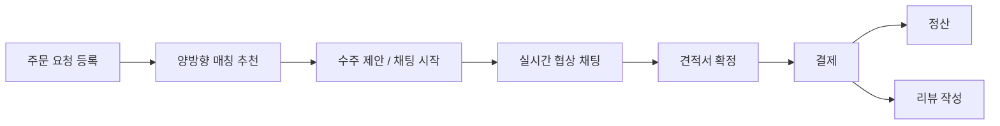

# MatchEAT

케이터링 · 식자재 대량 주문을 위한 B2B 매칭 플랫폼입니다.
구매자가 주문 요청을 등록하면 판매자의 상품과 매칭되고, 실시간 채팅으로 협상해 견적서를 확정한 뒤 결제·정산까지 이어집니다.

## 팀 소개

도메인 디렉터리가 담당자와 1:1로 매핑되도록 역할을 수직 분할해, 짧은 기간에도 코드 충돌을 최소화하며 개발했습니다.

| 참가자 | 담당 역할 | 담당 도메인 |
|---|---|---|
| 정민석 | 판매자 도메인 및 역매칭 | `product`, `matching/product`(역매칭), `estimate`, `review` |
| 김해송 (팀 리딩) | 실시간 협상 · AI · 결제 | `chat`, `quote`(AI 견적 요약), `payment`, 통합 브랜치 병합 전담 |
| 김현중 | 주문 라이프사이클 · 매칭 엔진 | `order`, `matching`(정매칭), `proposal` |
| 박한솔 | 인증 · 보안 · 계정 아키텍처 | `account`(회원가입 · 로그인 · JWT · 관리자 · 마이페이지) |

## 주요 기능

| 영역 | 기능 |
|---|---|
| 회원 | 이메일 로그인, JWT 인증, 판매자 승인 신청·심사, 회원 신고·정지·이의신청, 관리자 대시보드 |
| 주문 요청 | 구매자의 대량 주문 요청 등록·검색·관리 |
| 판매 조건(상품) | 등록·검색·수정·숨김 처리, 이미지 첨부, 수주 휴무일 관리, 카카오 지오코딩 |
| 매칭 | 하드 필터 + 소프트 점수 기반 양방향 매칭(정매칭/역매칭), Gemini 임베딩 기반 텍스트 유사도 |
| 수주 제안 | 판매자 → 구매자 수주 제안 |
| 견적 요청 | 구매자 → 판매자 견적 요청 |
| 채팅 | WebSocket/STOMP 기반 실시간 협상 채팅, 파일 교환 |
| 견적서 | 채팅 중 견적서(Quote) 협상·확정, Gemini 기반 AI 견적 요약 |
| 결제·정산 | 가상 결제, 영수증 발급, 정산 |
| 리뷰 | 결제 완료 거래에 대한 판매자 별점·후기 |

## 서비스 흐름



구매자가 주문 요청을 등록하거나, 판매자의 판매 조건에 직접 견적을 요청하는 두 가지 시작점이 있습니다.

- **판매자 주도**: 판매자가 구매자의 주문 요청을 보고 수주 제안을 보냅니다. 구매자가 채팅을 열어 조건을 협상하고, 견적서(Quote)를 확정합니다.
- **구매자 주도**: 구매자가 판매 조건 상세 화면에서 채팅을 걸거나 견적을 요청합니다.

채팅에서 확정된 견적서는 결제로 이어지고, 결제가 완료(COMPLETED) 상태가 되면 구매자는 해당 거래에 대해 리뷰를 남길 수 있습니다.

## 기술 스택

- **Backend**: Java 17, Spring Boot 4.1.1, Gradle
- **Web/Persistence**: Spring MVC(Thymeleaf SSR), Spring Data JPA, Spring Security + OAuth2 Resource Server(JWT)
- **실시간**: Spring WebSocket, STOMP
- **DB**: PostgreSQL, Flyway
- **AI**: Spring AI 2.0.1, Google Gemini(임베딩 · 요약)
- **외부 연동**: 카카오 지오코딩 · 길찾기 API
- **문서화**: springdoc-openapi 3.1.0

## 프로젝트 구조

```
.
├── src/main/java/org/example/matcheat/
│   ├── common/                # 지오코딩 등 공용 유틸리티
│   ├── config/                # Security, 예외 처리 등 전역 설정
│   ├── global/                # 전역 공통 컴포넌트
│   ├── main/                  # 메인 페이지
│   └── domain/
│       ├── account/           # 회원, 인증, 판매자 승인, 신고·정지, 관리자
│       ├── order/              # 주문 요청, 마이페이지 거래 내역 집계
│       ├── product/            # 판매 조건(상품)
│       ├── matching/           # 정매칭(주문 → 상품)
│       │   └── product/        # 역매칭(상품 → 주문), AI 텍스트 유사도
│       ├── proposal/           # 판매자 → 구매자 수주 제안
│       ├── estimate/           # 구매자 → 판매자 견적 요청
│       ├── chat/                # 실시간 협상 채팅, 파일 교환
│       ├── quote/               # 견적서 협상·확정, AI 요약
│       ├── payment/             # 결제, 영수증, 정산
│       └── review/              # 판매자 리뷰
├── src/main/resources/
│   ├── templates/                # Thymeleaf 화면 (도메인별 폴더)
│   └── static/                   # 도메인별 JS/CSS
└── docs/                         # 설계 문서, 작업 기록
```

## 로컬 실행

### 1. 사전 준비

- JDK 17
- PostgreSQL
- Google Gemini API Key
- 카카오 REST API Key

### 2. 환경변수 설정

`.env.example`을 참고해 `.env` 파일을 만들고 값을 채웁니다.

```env
DB_HOST=localhost
DB_NAME=matcheat
DB_USERNAME=
DB_PASSWORD=

JWT_SECRET=            # Base64 인코딩된 32바이트 이상의 랜덤 값
JWT_ISSUER=https://matcheat.local
JWT_AUDIENCE=matcheat-api

GEMINI_API_KEY=
KAKAO_REST_API_KEY=
```

실제 비밀값이 들어 있는 `.env` 파일은 Git에 커밋하지 않습니다.

### 3. 실행

```bash
./gradlew bootRun
```

- Web: http://localhost:8080
- Swagger UI: http://localhost:8080/swagger-ui/index.html

### 4. 테스트

```bash
./gradlew test
```

## 기술적 하이라이트

- **외부 API 장애를 방어하는 매칭 알고리즘** — `TextSimilarityCalculator`가 Gemini 임베딩으로 텍스트 유사도를 계산하되, API 장애 시 해당 항목만 제외하고 나머지 가중치를 재분배해 매칭 전체가 중단되지 않도록 설계했습니다. 하드 필터(필수 조건 배제)와 소프트 점수(선호도 환산)를 분리하고 단위 테스트로 검증했습니다.
- **AI 견적 요약의 환각 방지** — `QuoteAiSummaryClient`가 협상 채팅 로그에서 수량·단가·배송비 합의안을 추출하되, "대화에서 확인되지 않는 값을 추측하여 채우지 말라"는 명시적 프롬프트 제약으로 LLM 환각을 최소화했습니다.
- **헥사고날 아키텍처 기반 인증 분리** — 로그인/회원가입을 `domain`/`application`/`adapter`/`api` 계층으로 분리해 핵심 비즈니스 로직과 Spring Security를 포트-어댑터 패턴으로 격리했습니다. JWT 발급, 비밀번호 해싱, 관리자 계정 초기화를 단위 테스트로 고정했습니다.
- **판매자 라이프사이클 단독 완주** — 판매 상품 등록·수정, 이미지 첨부, 판매자 기준 매칭, 상품 역매칭까지 판매자 측 기능을 일관되게 구현했습니다. 계정 ID는 상품·견적·리뷰 응답 어디에도 그대로 노출하지 않고, 조회자가 본인인지 여부(boolean)만 전달하도록 설계했습니다.
- **결제 완료 기준 리뷰 · 평점 재계산** — 리뷰는 결제(Payment)가 COMPLETED 상태인 거래에 대해서만, 결제 1건당 1개까지 작성할 수 있습니다. 평점은 증분 계산이 아니라 리뷰가 새로 등록될 때마다 해당 상품의 리뷰 전체를 다시 조회해 재계산해, 누적 오차가 생기지 않습니다.
- **결제 중복 방지** — `payments.quote_id`에 유니크 제약을 걸어, 하나의 견적서에 결제가 중복 생성되지 않도록 DB 레벨에서 보장합니다.
- **도메인 수직 분할과 2단계 브랜치 전략** — 개별 기능 브랜치를 공용 통합 브랜치(`merge`)에 먼저 병합해 1차 충돌을 해결한 뒤 `main`으로 배포하는 전략으로, 4인 병렬 작업의 머지 충돌을 최소화했습니다.
