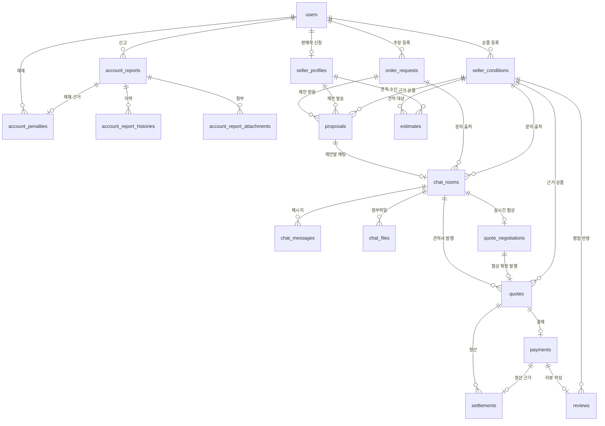

# MatchEAT 데이터베이스 스키마 설계서

## 1. 문서 개요

이 문서는 MatchEAT 케이터링·식자재 매칭 플랫폼의 데이터 구조, 테이블 관계, 제약조건, 인덱스를 정리한 문서다. 실제 운영 DB(PostgreSQL, Supabase)에 붙어서 확인한 내용을 기준으로 작성했다.

| 항목 | 내용 |
|---|---|
| DBMS | PostgreSQL(Supabase) |
| 스키마 관리 | Flyway가 아니라 **Hibernate `ddl-auto: update`** (`application-db.yaml`) |
| 애플리케이션 매핑 | Spring Data JPA / Hibernate |
| 시간 저장 | 테이블마다 다르다. `users`/`seller_profiles`/`account_*`는 `TIMESTAMPTZ`, 그 외 도메인(`product`/`order`/`proposal`/`estimate`/`chat`/`quote`/`payment`/`review`)은 `TIMESTAMP`(타임존 없음)로 저장한다. |
| 이미지 저장 | Supabase Storage를 쓰지 않고, 상품·견적·리뷰 이미지는 **Base64로 인코딩해 TEXT 컬럼에 직접 저장**한다(`seller_conditions.image_url`, `estimates.estimate_image`, `reviews.image_url`). 채팅 첨부파일만 별도 경로(`chat_files.file_path`)로 관리한다. |

스키마의 기준 원본은 JPA 엔티티다. `db/migration` 형태의 Flyway SQL은 존재하지 않고, 애플리케이션이 기동될 때 Hibernate가 엔티티 정의를 보고 스키마를 자동으로 맞춘다. 이 방식의 특성상, **엔티티를 바꿔도 기존에 이미 생성된 제약조건(예: CHECK)은 자동으로 갱신되지 않는 경우가 있다** — 6절에서 실제로 발견된 사례를 정리했다.

## 2. 전체 데이터 관계



핵심 관계는 다음과 같다.

- 회원 한 명은 판매자 프로필을 최대 하나 가질 수 있다(`seller_profiles.user_id` UNIQUE).
- 거래(견적서)는 채팅방이 있든 없든 발행될 수 있다 — `quotes.chat_room_id`는 필수지만, 채팅 없이 바로 견적을 주고받는 "독립 견적" 경로도 있다.
- 채팅방 하나에는 실시간 협상 중간 산출물(`quote_negotiations`)이 최대 1건만 존재하고, 잠금(확정) 처리되면 `quotes`로 발행된다.
- 견적서(`quotes`) 1건에는 결제(`payments`)가 최대 1건만 연결된다(UNIQUE).
- 결제 1건에는 정산(`settlements`)과 리뷰(`reviews`)가 각각 최대 1건만 연결된다(둘 다 UNIQUE).
- 신고 처리 결과로 제재(`account_penalties`)가 내려질 수 있다.

## 3. 테이블 정의

### 3.1 회원 · 인증 · 관리자

#### `users` — 회원

| 컬럼 | 형식 | 필수 | 설명 |
|---|---|---:|---|
| `user_id` | BIGINT | Y | 회원 PK |
| `email` | VARCHAR | Y | 로그인 이메일, UNIQUE |
| `password_hash` | VARCHAR | N | 암호화된 비밀번호 |
| `name` | VARCHAR | Y | 회원 이름 |
| `role` | VARCHAR | Y | `USER`, `SELLER`, `ADMIN` |
| `status` | VARCHAR | Y | `ACTIVE`, `SUSPENDED`, `WITHDRAWN` |
| `token_version` | INTEGER | Y | 발급된 JWT 무효화에 쓰는 버전 값 |
| `manual_suspension` | BOOLEAN | Y | 관리자 수동 정지 여부 |
| `manual_suspension_reason` | VARCHAR | N | 수동 정지 사유 |
| `created_at`, `updated_at` | TIMESTAMPTZ | Y | 생성·수정 시각 |
| `withdrawn_at` | TIMESTAMPTZ | N | 탈퇴 시각 |

`role`이 `SELLER`로 바뀌는 시점은 관리자가 `seller_profiles`를 승인 처리하는 순간이다(같은 트랜잭션에서 함께 처리). `role` 자체만으로 승인 여부를 판단하지 않는 도메인도 있다 — 아래 3.2 참고.

#### `seller_profiles` — 판매자 승인 신청

| 컬럼 | 형식 | 필수 | 설명 |
|---|---|---:|---|
| `seller_id` | BIGINT | Y | 판매자 프로필 PK. **다른 도메인 전반에서 "판매자"를 가리키는 공통 식별자**로 쓰인다(계정 ID가 아님) |
| `user_id` | BIGINT | Y | 신청 회원 FK, UNIQUE(계정당 1개) |
| `business_name` | VARCHAR | Y | 상호명 |
| `business_number` | VARCHAR | Y | 사업자등록번호, UNIQUE |
| `verification_status` | VARCHAR | Y | `PENDING`, `APPROVED`, `REJECTED` |
| `rejection_reason` | VARCHAR | N | 반려 사유 |
| `latitude`, `longitude` | NUMERIC | N | 사업장 위치 |
| `delivery_radius_km` | NUMERIC | N | 배달 가능 반경 |
| `reviewed_by` | BIGINT | N | 심사한 관리자 FK |
| `reviewed_at` | TIMESTAMPTZ | N | 심사 시각 |
| `applied_at` | TIMESTAMPTZ | Y | 신청 시각 |
| `version` | BIGINT | Y | 낙관적 락 버전 |

`domain/product`는 이 테이블의 `verification_status`를 직접 조회해서 "승인된 판매자인지"를 판단하고, `SecurityConfig`는 `users.role`(JWT)을 보고 판단한다. 같은 판단을 두 신호로 하고 있어 향후 "자격 정지" 같은 기능이 생기면 두 값이 어긋날 여지가 있다.

#### `account_reports` / `account_report_histories` / `account_report_attachments` — 신고 처리

| 테이블 | 설명 |
|---|---|
| `account_reports` | 회원 신고 내역. `target_type`은 `ORDER_REQUEST`, `PROPOSAL`, `ESTIMATE`, `QUOTE`, `CHAT_ROOM`, `PRODUCT` 중 하나이며, `status`는 `PENDING`/`IN_REVIEW`/`RESOLVED`/`REJECTED`다. |
| `account_report_histories` | 신고 처리 상태 변경 이력. |
| `account_report_attachments` | 신고에 첨부된 파일. `stored_name`이 UNIQUE다. |

`account_reports`에는 **부분 유니크 인덱스**(`uk_account_reports_open_target`)가 걸려 있어, 같은 신고자가 같은 대상에 대해 `PENDING`/`IN_REVIEW` 상태의 신고를 동시에 두 건 이상 열어둘 수 없다(처리 완료된 신고는 다시 신고할 수 있다).

#### `account_penalties` — 제재

| 컬럼 | 형식 | 필수 | 설명 |
|---|---|---:|---|
| `penalty_id` | BIGINT | Y | 제재 PK |
| `user_id` | BIGINT | Y | 제재 대상 회원 FK |
| `report_id` | BIGINT | Y | 근거가 된 신고 FK |
| `issued_by` | BIGINT | Y | 제재를 내린 관리자 FK |
| `reason` | VARCHAR | Y | 제재 사유 |
| `issued_at` | TIMESTAMPTZ | Y | 제재 시각 |
| `expires_at` | TIMESTAMPTZ | Y | 제재 만료 시각 |
| `released_at` | TIMESTAMPTZ | N | 조기 해제 시각 |

### 3.2 상품 · 주문 · 제안 · 견적 요청

#### `seller_conditions` — 판매 조건(상품)

| 컬럼 | 형식 | 필수 | 설명 |
|---|---|---:|---|
| `id` | BIGINT | Y | PK |
| `owner_account_id` | BIGINT | N | 등록 판매자 계정 ID. **FK 제약 없음**, `users.user_id`를 논리 참조 |
| `product_name` | VARCHAR | Y | 상품명 |
| `min_headcount`, `max_headcount` | INTEGER | Y | 최소/최대 주문 수량 |
| `serving_price` | INTEGER | Y | 1인분 가격 |
| `delivery_radius_km` | DOUBLE | Y | 배달 가능 반경 |
| `store_address`, `store_address_detail` | VARCHAR | Y/N | 가게 주소, 상세 주소 |
| `latitude`, `longitude` | DOUBLE | N | 카카오 지오코딩으로 계산된 위경도 |
| `category` | VARCHAR | Y | 카테고리 |
| `description` | TEXT | N | 상품 설명 |
| `day_of_week` | VARCHAR | N | 정기 휴무 요일(`MONDAY`~`SUNDAY`) |
| `unavailable_dates` | TEXT | N | 특정 휴무 날짜 목록(직렬화 저장) |
| `image_url` | TEXT | N | 상품 이미지(Base64) |
| `hidden` | BOOLEAN | Y | 소프트 삭제 여부 |
| `rating_avg` | DOUBLE | N | 평점. `reviews`가 새로 등록될 때마다 그 상품의 리뷰 전체를 재조회해 재계산한다(증분 계산 아님) |
| `updated_at` | TIMESTAMP | Y | 수정 시각. **`created_at` 컬럼은 없다** |

#### `order_requests` — 주문 요청

| 컬럼 | 형식 | 필수 | 설명 |
|---|---|---:|---|
| `id` | BIGINT | Y | PK |
| `buyer_id` | BIGINT | Y | 등록 구매자 계정 ID. FK 제약 없음 |
| `title`, `description` | VARCHAR | N | 제목, 설명 |
| `category` | VARCHAR | Y | 카테고리 |
| `quantity` | INTEGER | Y | 주문 수량 |
| `budget` | NUMERIC | Y | 예산 |
| `budget_type` | VARCHAR | Y | `PER_PERSON`, `TOTAL` |
| `event_date_time` | TIMESTAMP | Y | 행사 일시 |
| `delivery_address`, `delivery_address_detail` | VARCHAR | Y/N | 배송지 |
| `latitude`, `longitude` | DOUBLE | Y | 배송지 위경도 |
| `reference_image_url` | TEXT | N | 참고 이미지 |
| `status` | VARCHAR | Y | `MATCHING`, `IN_TALK`, `CONFIRMED`, `CANCELLED`, `CLOSED` |

`status`는 CHECK 제약상 5가지 값이 정의돼 있지만, 실제로 엔티티에는 `CANCELLED`로 바꾸는 취소 메소드만 있고 `CONFIRMED`/`IN_TALK`/`CLOSED`로 전이시키는 코드는 없다 — 정의된 값과 실제로 쓰이는 값 사이에 차이가 있다.

#### `proposals` — 수주 제안 (판매자 → 구매자)

| 컬럼 | 형식 | 필수 | 설명 |
|---|---|---:|---|
| `id` | BIGINT | Y | PK |
| `request_id` | BIGINT | Y | 대상 주문 요청. FK 제약 없음, `order_requests.id` 논리 참조 |
| `seller_id` | BIGINT | Y | 제안한 판매자. FK 제약 없음, `seller_profiles.seller_id` 논리 참조 |
| `product_id` | BIGINT | N | 근거가 된 판매 조건. 등록 상품 기반 제안이면 값이 있고, 직접 입력 제안이면 `NULL` |
| `item_name` | VARCHAR | Y | 품목명. `product_id`가 있으면 그 상품명을 그대로 복사, 없으면 자유 입력 |
| `quantity` | INTEGER | Y | 수량 |
| `unit_price` | BIGINT | Y | 단가 |
| `total_amount` | BIGINT | Y | 총액 |
| `preparation_days` | INTEGER | Y | 준비 소요일 |
| `description` | TEXT | N | 제안 설명 |
| `status` | VARCHAR | Y | `SENT`, `IN_TALK`, `ACCEPTED`, `REJECTED`, `WITHDRAWN` |
| `created_at` | TIMESTAMP | Y | 생성 시각 |

#### `estimates` — 견적 요청 (구매자 → 판매자)

| 컬럼 | 형식 | 필수 | 설명 |
|---|---|---:|---|
| `id` | BIGINT | Y | PK |
| `request_id` | BIGINT | Y | **다른 테이블과 다르게, 별도 요청 테이블의 FK가 아니라 요청자(구매자) 본인의 `users.user_id`를 그대로 저장**한다 |
| `seller_id` | BIGINT | Y | 견적 대상 판매자. FK 제약 없음, `seller_profiles.seller_id` 논리 참조 |
| `product_id` | BIGINT | N | 근거 상품. FK 제약 없음, nullable |
| `item_name` | VARCHAR | Y | 품목명 |
| `quantity` | INTEGER | Y | 수량 |
| `budget` | NUMERIC | Y | 예산 |
| `budget_type` | VARCHAR | Y | `PER_PERSON`, `TOTAL` |
| `event_date_time` | TIMESTAMP | Y | 행사 일시 |
| `delivery_address`, `delivery_address_detail` | VARCHAR | Y/N | 배송지 |
| `latitude`, `longitude` | DOUBLE | N | 카카오 지오코딩 위경도 |
| `description` | TEXT | N | 상세 설명 |
| `estimate_image` | TEXT | N | 견적 이미지(Base64) |
| `status` | VARCHAR | Y | 아래 참고 |
| `created_at` | TIMESTAMP | Y | 생성 시각 |

> **불일치 발견**: 엔티티(`EstimateStatus`)에는 `REQUESTED`, `IN_TALK`, `ACCEPTED`, `REJECTED`, `WITHDRAWN` 5개 값이 정의돼 있는데, 실제 DB의 CHECK 제약(`estimates_status_check`)은 `REQUESTED`, `ACCEPTED`, `REJECTED`, `CANCELED` 4개(예전 값)로 남아 있다. `ddl-auto: update`가 기존에 생성된 CHECK 제약을 자동으로 갱신하지 않아서 생긴 차이다. 지금은 `IN_TALK`/`WITHDRAWN` 상태로 실제 전이시키는 코드가 없어 문제가 드러나지 않지만, 나중에 상태 전이 기능을 추가하면 이 값들을 저장하는 순간 DB CHECK 제약 위반으로 실패한다. 6절에 보완 과제로 정리했다.

### 3.3 채팅 · 견적서 · 협상

#### `chat_rooms` — 협상 채팅방

| 컬럼 | 형식 | 필수 | 설명 |
|---|---|---:|---|
| `id` | BIGINT | Y | PK |
| `buyer_id`, `seller_id` | BIGINT | N | 참여자. FK 제약 없음 |
| `origin_type` | VARCHAR | N | `INQUIRY`(직접 문의) 또는 `PROPOSAL`(제안 기반). **CHECK 제약은 없다**(코드 레벨에서만 검증) |
| `proposal_id` | BIGINT | N | `origin_type=PROPOSAL`일 때 연결되는 제안 |
| `order_request_id`, `product_id` | BIGINT | N | `origin_type=INQUIRY`일 때 문의 출처 |
| `quote_id` | BIGINT | N | 이 채팅방에서 발행된 견적서 |
| `status` | VARCHAR | Y | 값 목록에 대한 DB CHECK 제약 없음 |
| `created_at` | TIMESTAMP | Y | 생성 시각 |

견적 요청(`estimates`)으로 시작하는 채팅방 유형은 아직 없다 — `origin_type`이 `INQUIRY`/`PROPOSAL` 둘뿐이라, 구매자가 견적을 요청해도 그 자체로는 채팅·결제로 이어지지 않는다.

#### `chat_messages`, `chat_files` — 메시지 · 첨부파일

| 테이블 | 설명 |
|---|---|
| `chat_messages` | 채팅 메시지. `content`는 텍스트, `chat_file_id`가 있으면 파일 메시지(FK 제약 있음, `chat_files.id` 참조). |
| `chat_files` | 채팅 첨부파일의 원본명·저장명·경로·크기·MIME 타입을 저장한다. 실제 바이너리는 별도 경로(`file_path`)에 저장한다. |

#### `quotes` — 견적서

| 컬럼 | 형식 | 필수 | 설명 |
|---|---|---:|---|
| `id` | BIGINT | Y | PK |
| `chat_room_id` | BIGINT | Y | 발행된 채팅방. FK 제약 없음 |
| `buyer_id`, `seller_id` | BIGINT | Y | 거래 당사자 |
| `product_id` | BIGINT | N | 근거 상품(있는 경우) |
| `sender_role` | VARCHAR | N | `BUYER`, `SELLER` — 누가 먼저 견적을 냈는지 |
| `quantity`, `unit_price`, `delivery_fee`, `total_amount` | INTEGER/BIGINT | Y | 견적 금액 |
| `additional_notes` | TEXT | N | 비고 |
| `status` | VARCHAR | Y | `SENT`, `ACCEPTED`, `REJECTED`, `WITHDRAWN` |
| `created_at` | TIMESTAMP | Y | 생성 시각 |

채팅방을 거치지 않고, 구매자·판매자가 서로 지정해서 바로 견적을 주고받는 "독립 견적" 생성 경로도 있다(이 경우도 `chat_room_id`는 값이 필요하다).

#### `quote_negotiations` — 실시간 협상 중간본

| 컬럼 | 형식 | 필수 | 설명 |
|---|---|---:|---|
| `id` | BIGINT | Y | PK |
| `chat_room_id` | BIGINT | Y | 대상 채팅방, **UNIQUE**(채팅방당 1건) |
| `buyer_id`, `seller_id` | BIGINT | Y | 협상 당사자 |
| `product_id` | BIGINT | N | 근거 상품 |
| `quantity`, `unit_price`, `delivery_fee`, `total_amount` | INTEGER/BIGINT | N | 협상 중인 금액(계속 수정 가능) |
| `status` | VARCHAR | Y | `NEGOTIATING`(자유 수정) → `AI_SUMMARIZED`(AI 요약) → `LOCKED`(확정) |
| `ai_summary_used`, `ai_summary_used_at` | BOOLEAN/TIMESTAMP | N | AI 요약 사용 여부·시각 |
| `resulting_quote_id` | BIGINT | N | 잠금 후 발행된 `quotes` 레코드 |
| `locked_at` | TIMESTAMP | N | 잠금 시각 |
| `version` | BIGINT | Y | 낙관적 락 버전 |

`Estimate`(정적 요청서 1회 제출)와 달리, 이 테이블은 채팅 중 계속 값을 고쳐가며 만드는 동적인 중간 산출물이다.

### 3.4 결제 · 정산 · 리뷰

#### `payments` — 결제

| 컬럼 | 형식 | 필수 | 설명 |
|---|---|---:|---|
| `id` | BIGINT | Y | PK |
| `quote_id` | BIGINT | Y | 대상 견적서, **UNIQUE**(견적서 1건당 결제 1건) |
| `buyer_id`, `seller_id` | BIGINT | Y | 결제 당사자 |
| `quantity`, `unit_price`, `delivery_fee`, `amount` | INTEGER/BIGINT | Y/N | 결제 금액 |
| `status` | VARCHAR | Y | `PENDING`, `COMPLETED`, `FAILED`, `CANCELLED` |
| `pg_transaction_id` | VARCHAR | N | 가상 PG 거래 ID |
| `failure_reason` | VARCHAR | N | 실패 사유 |
| `paid_at` | TIMESTAMP | N | 결제 완료 시각 |

리뷰는 `status = COMPLETED`인 결제 건에 대해서만 작성할 수 있다.

#### `settlements` — 정산

| 컬럼 | 형식 | 필수 | 설명 |
|---|---|---:|---|
| `id` | BIGINT | Y | PK |
| `payment_id` | BIGINT | Y | 대상 결제, **UNIQUE**(결제 1건당 정산 1건) |
| `quote_id` | BIGINT | Y | 대상 견적서 |
| `buyer_id`, `seller_id` | BIGINT | Y | 정산 당사자 |
| `quantity`, `unit_price`, `delivery_fee`, `total_amount` | INTEGER/BIGINT | N | 정산 금액 |
| `additional_notes` | TEXT | N | 비고 |
| `issued_at` | TIMESTAMP | N | 정산 발행 시각 |

#### `reviews` — 판매자 리뷰

| 컬럼 | 형식 | 필수 | 설명 |
|---|---|---:|---|
| `id` | BIGINT | Y | PK |
| `payment_id` | BIGINT | Y | 대상 결제, **UNIQUE**(결제 1건당 리뷰 1개) |
| `buyer_id` | BIGINT | Y | 작성자 |
| `seller_id` | BIGINT | Y | 리뷰 대상 판매자 |
| `product_id` | BIGINT | N | 연결된 상품. `Payment → Quote → ChatRoom(원인이 PROPOSAL인 경우) → Proposal.productId` 경로로 찾아서 채운다. 경로가 끊기면(채팅 없는 독립 견적, 문의로 시작한 채팅 등) `NULL`로 남고, 이 경우 리뷰는 저장되지만 어떤 상품의 평점에도 반영되지 않는다 |
| `rating` | INTEGER | Y | 별점 1~5 (DB 레벨 범위 CHECK는 없고, 애플리케이션에서만 검증한다) |
| `content` | TEXT | Y | 리뷰 내용 |
| `image_url` | TEXT | N | 리뷰 이미지(Base64) |
| `created_at` | TIMESTAMP | Y | 작성 시각 |

## 4. 주요 상태 흐름

### 거래 성사 흐름

```text
[제안 경로]  order_requests → proposals(SENT) → chat_rooms(origin=PROPOSAL) → quotes → payments(COMPLETED)
[문의 경로]  seller_conditions → chat_rooms(origin=INQUIRY) → quotes → payments(COMPLETED)
[견적 경로]  seller_conditions → estimates(REQUESTED) → (더 이상 이어지는 경로 없음)
```

세 시작점 중 **`estimates`(견적 요청)만 실제 결제 파이프라인과 연결돼 있지 않다.** `chat_rooms.origin_type`에 `ESTIMATE`에 해당하는 값이 없어서, 구매자가 견적을 요청해도 그것이 채팅이나 결제로 자동으로 이어지지 않는다.

### 결제 후 흐름

```text
payments(COMPLETED)
  ├─→ settlements (정산, 결제 1건당 1건)
  └─→ reviews (리뷰, 결제 1건당 1개, 구매자 본인 결제 건만)
```

## 5. 제약조건과 동시성

- FK 제약은 `account_*`, `seller_profiles`에만 걸려 있다. 그 외 도메인은 애플리케이션 레벨에서만 참조를 관리하며, DB가 참조 무결성을 강제하지 않는다.
- `users.email`, `seller_profiles.business_number`, `seller_profiles.user_id`는 UNIQUE다.
- `payments.quote_id`, `quote_negotiations.chat_room_id`, `settlements.payment_id`, `reviews.payment_id`는 각각 UNIQUE로, "1건에 최대 1개"를 DB 레벨에서 보장한다.
- `account_reports`는 부분 유니크 인덱스로 "같은 신고자가 같은 대상에 진행 중인 신고를 중복으로 열 수 없음"을 보장한다.
- 낙관적 락(`version` 컬럼)은 `seller_profiles`, `account_reports`, `quote_negotiations`에 있다. `payments`에는 `version` 컬럼이 없고, 결제 동시 생성 방지는 `uk_payments_quote_id` UNIQUE 제약에 의존한다 — 같은 견적서에 결제가 동시에 두 번 시도되면 두 번째 INSERT가 제약 위반으로 실패하는 방식이다.
- 여러 CHECK 제약(`status`, `budget_type`, `day_of_week` 등)으로 허용 값을 제한한다. 정확한 값 목록은 3절 각 테이블 설명을 참고한다.

## 6. 주요 인덱스

| 테이블 | 인덱스 대상 | 목적 |
|---|---|---|
| `chat_rooms` | `(buyer_id, status, created_at)`, `(seller_id, status, created_at)` | 참여자별 채팅방 목록 조회 |
| `proposals` | `(request_id, status, created_at)`, `(seller_id, status, created_at)` | 주문별·판매자별 제안 목록 조회 |
| `quotes` | `(buyer_id, status, created_at)`, `(seller_id, status, created_at)` | 당사자별 견적서 목록 조회 |
| `account_reports` | `(reporter_id, created_at)`, `(status, created_at)` | 신고자별·상태별 신고 목록 조회 |
| `account_report_histories` | `(report_id, changed_at)` | 신고별 처리 이력 조회 |
| `account_penalties` | `report_id`, `(user_id, expires_at)` | 신고별·만료 임박 제재 조회 |

## 7. 현재 보완 과제

1. **`estimates_status_check` CHECK 제약이 코드보다 낡았다.** 엔티티는 5개 상태값(`IN_TALK`, `WITHDRAWN` 포함)을 쓰지만 DB 제약은 4개(`CANCELED` 포함, `IN_TALK`/`WITHDRAWN` 없음)로 남아 있다. 상태 전이 기능을 실제로 붙이기 전에 제약을 맞춰야 한다.
2. **`estimates`가 실제 결제 파이프라인과 연결되지 않는다.** `chat_rooms.origin_type`에 견적 요청 경로가 없어, 구매자가 견적을 요청해도 그 이후(채팅·견적서·결제)로 이어지지 않는다.
3. **FK 제약이 대부분 없다.** 애플리케이션 로직으로만 참조를 관리하고 있어, 데이터 정합성이 코드 품질에 크게 의존한다.
4. **시간 컬럼 타입이 도메인마다 다르다.** `TIMESTAMPTZ`와 `TIMESTAMP`(타임존 없음)가 섞여 있어, 타임존 처리 방식을 하나로 통일할 필요가 있다.
5. **이미지가 Base64로 DB에 직접 저장된다.** 별도 파일 크기 제한이 없어, 트래픽이 늘면 DB 부담이 커질 수 있다.
6. **`chat_rooms.status`, `chat_rooms.origin_type`에 DB CHECK 제약이 없다.** 허용 값 검증이 애플리케이션 레벨에만 있다.
